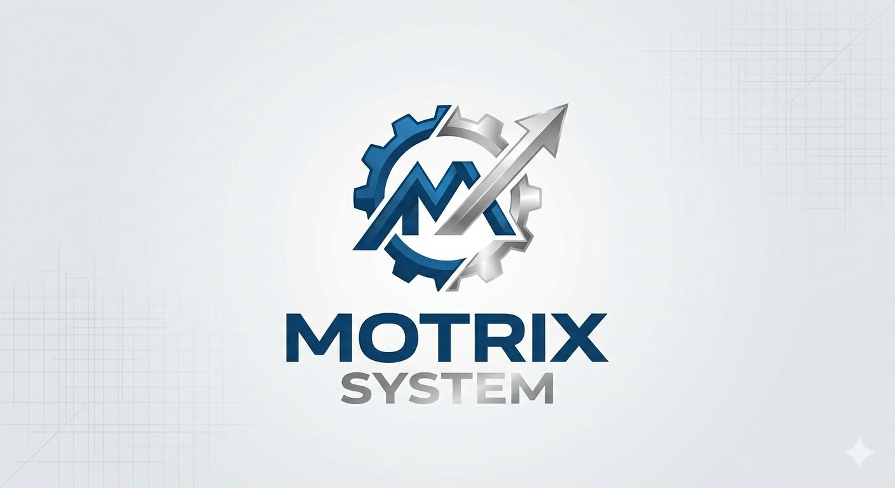
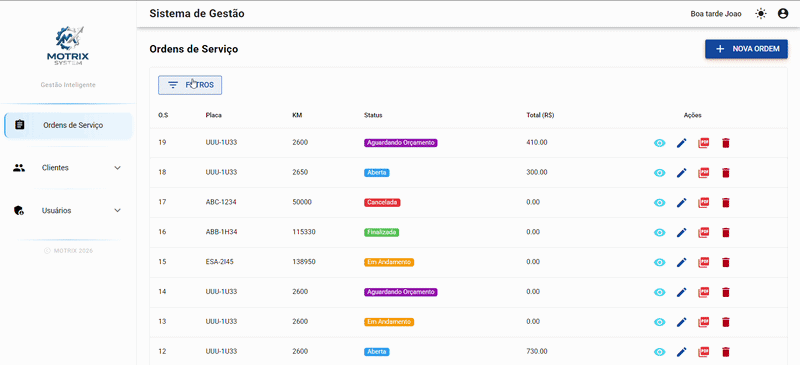
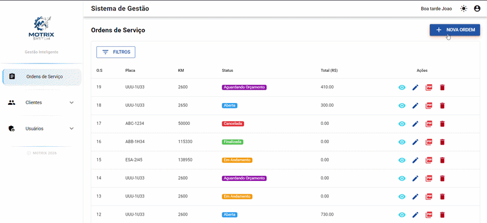
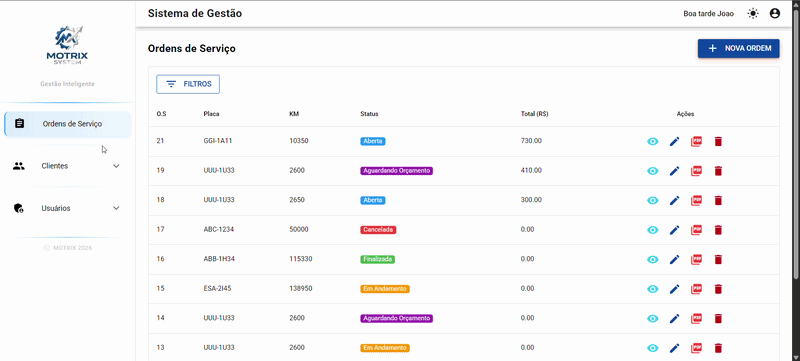
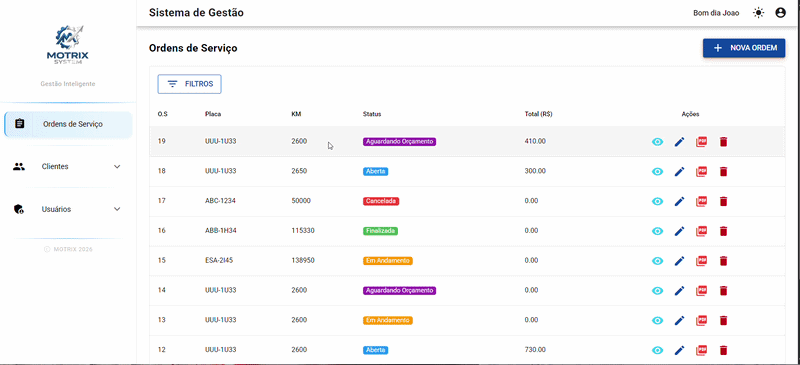
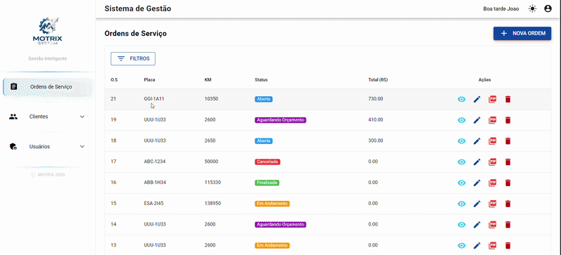
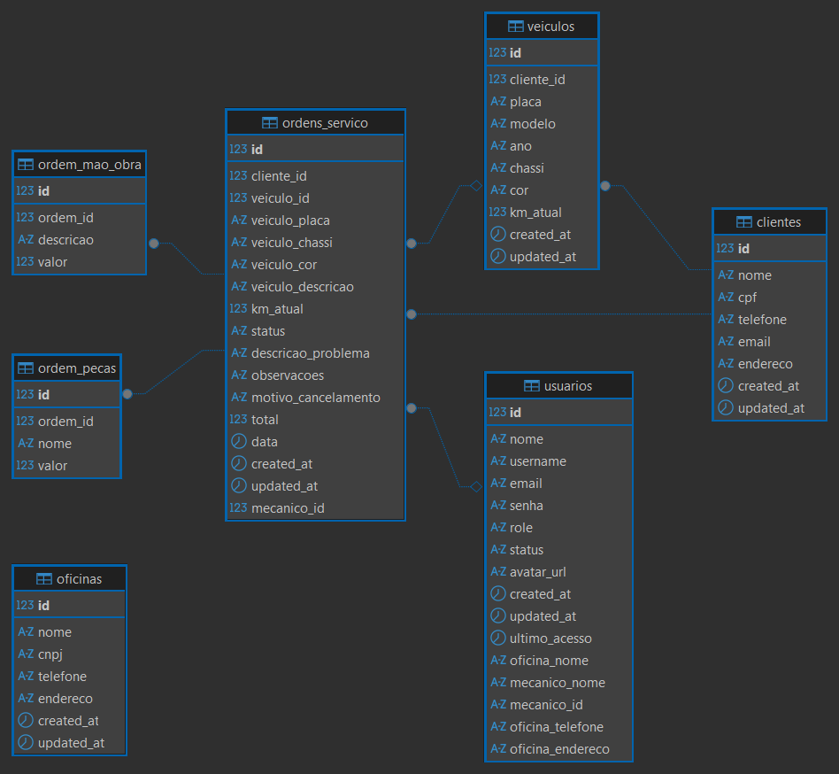

# Motrix System - Sistema de Gestão para Oficinas Mecânicas

<p align="center">
  
</p>

Sistema completo de **gestão para oficinas mecânicas**, desenvolvido com arquitetura moderna separando **Frontend, Backend e Banco de Dados**.

O objetivo do sistema é facilitar o gerenciamento de:

- Ordens de serviço
- Clientes
- Veículos
- Usuários
- Peças e mão de obra
- Relatórios profissionais em PDF

---

# Demonstração do Sistema

## Interface do Sistema



## Ordem de Serviço



## Gestão de Clientes

<!-- ADICIONAR PRINT DO CADASTRO DE CLIENTE -->



## Geração de PDF

<!-- ADICIONAR GIF GERANDO PDF -->



---

# Arquitetura do Projeto

O sistema segue uma arquitetura **Full Stack separada em três camadas principais**:

Frontend (Vue + Quasar)
│
│ API REST
▼
Backend (Node + Express + TypeScript)
│
▼
Banco de Dados (PostgreSQL)

---

# Frontend

O frontend foi desenvolvido utilizando **Vue 3 com Quasar Framework**, focando em performance, responsividade e experiência do usuário.

### Tecnologias Utilizadas

- **Vue 3**
- **Quasar Framework**
- **Vue Router**
- **Vite**
- **Axios**
- **ESLint**
- **Prettier**
- **PostCSS**
- **Autoprefixer**

### Características do Frontend

- Interface moderna e responsiva
- Paginação inteligente
- Filtros avançados
- Autenticação com JWT
- Integração com API REST
- Lazy Loading de rotas
- Componentização com Vue

---

# Demonstração do Sistema

## Tela de Login


## Listagem de Ordens de Serviços cadastradas



---

# Backend

O backend foi desenvolvido em **Node.js com TypeScript**, seguindo uma arquitetura modular baseada em **controllers, services e repositories**.

### Tecnologias Utilizadas

- **Node.js**
- **Express**
- **TypeScript**
- **JWT (JSON Web Token)**
- **bcryptjs**
- **express-validator**
- **dotenv**
- **CORS**
- **PDFKit**
- **Winston**
- **Morgan**

---

### Arquitetura Backend

Controller
↓
Service
↓
Repository
↓
Database

Essa estrutura permite:

- código organizado
- fácil manutenção
- escalabilidade do sistema

---

### Sistema de Autenticação

O sistema utiliza **JWT para autenticação segura**.

Funcionalidades:

- Login seguro
- Proteção de rotas
- Controle de permissões
- Sessão persistente

Roles disponíveis:

- **Admin**
- **User**

---

# Banco de Dados

O banco de dados utilizado é **PostgreSQL**, estruturado para garantir integridade e performance.

### Tecnologias

- **PostgreSQL**
- **pg (node-postgres)**

---

### Estrutura das Tabelas

Principais tabelas do sistema:

- `usuarios`
- `clientes`
- `veiculos`
- `ordens_servico`
- `ordem_pecas`
- `ordem_mao_obra`
- `oficinas`

---

### Relacionamentos principais

Cliente
│
└── Veículos
│
└── Ordens de Serviço
│
├── Peças
└── Mão de Obra

---

### Diagrama das tabelas



# Geração de PDF

O sistema gera **PDF profissional das ordens de serviço** contendo:

- Dados da oficina
- Dados do cliente
- Informações do veículo
- Lista de peças
- Lista de mão de obra
- Valor total
- Campos para assinatura

Formato: **A4 pronto para impressão**

---

# Funcionalidades do Sistema

### Gestão de Clientes

- Cadastro completo
- Histórico de serviços
- Gerenciamento de veículos

### Gestão de Veículos

- Registro de veículos
- Controle de quilometragem
- Histórico de manutenção

### Ordens de Serviço

- Criação de OS
- Controle de status
- Registro de peças e mão de obra
- Cálculo automático de valores
- Geração de PDF

### Gestão de Usuários

- CRUD completo
- Controle de permissões
- Status ativo/inativo

---

# Performance e Otimizações

- Paginação inteligente
- Lazy loading de rotas
- Índices no banco de dados
- Cache de requisições
- Build otimizado com Vite

---

# API Integration

O sistema se comunica com uma API REST através dos seguintes serviços:

---

### Endpoints Principais

#### Autenticação

| Método | Endpoint         | Descrição |
| ------ | ---------------- | --------- |
| POST   | `/auth/login`    | Login     |
| POST   | `/auth/register` | Registro  |

#### Ordens de Serviço

| Método | Endpoint          | Descrição                     |
| ------ | ----------------- | ----------------------------- |
| GET    | `/ordens`         | Listar ordens (com paginação) |
| GET    | `/ordens/:id`     | Buscar ordem por ID           |
| POST   | `/ordens`         | Criar nova ordem              |
| PUT    | `/ordens/:id`     | Atualizar ordem               |
| DELETE | `/ordens/:id`     | Excluir ordem                 |
| GET    | `/ordens/:id/pdf` | Baixar PDF da ordem           |

#### Clientes

| Método | Endpoint                  | Descrição             |
| ------ | ------------------------- | --------------------- |
| GET    | `/clientes`               | Listar clientes       |
| GET    | `/clientes/:id`           | Buscar cliente por ID |
| POST   | `/clientes`               | Criar cliente         |
| PUT    | `/clientes/:id`           | Atualizar cliente     |
| DELETE | `/clientes/:id`           | Excluir cliente       |
| GET    | `/clientes/:id/historico` | Histórico de serviços |

#### Usuários

| Método | Endpoint        | Descrição             |
| ------ | --------------- | --------------------- |
| GET    | `/usuarios`     | Listar usuários       |
| GET    | `/usuarios/:id` | Buscar usuário por ID |
| POST   | `/usuarios`     | Criar usuário         |
| PUT    | `/usuarios/:id` | Atualizar usuário     |
| DELETE | `/usuarios/:id` | Excluir usuário       |

#### Oficina

| Método | Endpoint             | Descrição                  |
| ------ | -------------------- | -------------------------- |
| GET    | `/oficina`           | Buscar dados da oficina    |
| PUT    | `/oficina`           | Atualizar dados da oficina |
| GET    | `/oficina/mecanicos` | Listar mecânicos           |

---

### Autenticação

Todas as requisições (exceto login) requerem token JWT no header:

```http
Authorization: Bearer <token>
```

O token é armazenado automaticamente no `localStorage` após o login.

---

# Deploy

O sistema pode ser hospedado utilizando:

- **Render**
- **Vercel**
- **Netlify**
- **AWS**
- **Nginx**
- **Docker**

---

# Autor

**João Victor Rufo Pereira**

GitHub:  
https://github.com/JaoRufo

Email:  
joaovictorrufopereira44@gmail.com

---

# Licença

Este projeto foi desenvolvido para o sistema **Motrix System**.

Sistema criado para **gestão de oficinas mecânicas**.
